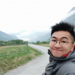
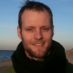

**Marlene Härtel**

I am the speaker of the Communication Group of the HeJus. Science communication and networking are very important to me, because I enjoy the exchange with others. I like the creative aspect of making science accessible and understandable to anyone. My research focuses on developing transparent contacts by plasma based physical vapour deposition for solar cells. At the Helmholtz-Zentrum Berlin I work in a very ambitious young investigators group, that breaks efficiency world records for Perovskite tandem solar cells. My contribution to this is to find out why the deposition process of the transparent contacts degenerates the opto-electrical properties of the Perovskite sub-cell and how this can be circumvented. Outside of the lab, I am dedicated to food and sports. I love to cook, try new things and experience the cultural aspect of eating. The Korean, Thai, Chinese and Vietnamese cuisine are amongst my favourites. I can spend hours preparing food, it’s like meditation after a stressful working day to me. To compensate for all of that, I do many sports as well, including Volleyball, Surfing and weight-lifting.

**Xin You**

I am currently a doctoral researcher at Helmholtz Centre for Environmental Research - UFZ. I come from China and have previously studied in China, Germany, Austria and Brazil. I am a fan of nature and microbes and my PhD research is about the smallest microbe on Earth - bacteriophages (phages). They are the kind of virus that only kills bacteria and I study their transport mechanisms and interactions with other microorganisms, such as non-host bacteria and fungi in the terrestrial subsurface. I believe good communicative is the bridge between confusion and clarity, with no exception to science. As a member of HeJu (2020/2021), I am working in the communication group to bridge internal and external information gaps as well as to visualize concepts and ideas for HeJu campaigns. I am quite a easy-going person, so feel free to connect me [@EnViruSoil](https://twitter.com/EnViruSoil) on twitter.

**Former authors**

**Giulia Caglio**

I am an italian doctoral researcher at the Max Delbrueck Center for Molecular Biology (MDC) in Berlin. After studying Biotechnology in Rome and a master thesis at the Weizmann Insitute of Science in Israel on Hematopoietic Stem Cells, I am currently working on Epigenetics via Bioinformatic tools. I believe communication is key to progress and improvement in society - scientific and not - therefore I have joined the HeJus, with the aim of spreading news and informations, as well as enhancing the visibility of the association. I spend my time reading and chatting and enjoying Berlin, but mostly I love traveling: whenever I have a chance I plan my next trip somewhere in the globe, nowhere is too far!

**Mariam Rizkallah**

I am a Doctoral Researcher at Alfred Wegener Institute, Helmholtz Center for Polar and Marine Research (AWI) in Bremerhaven. I received my Bachelor from Faculty of Pharmacy, Cairo University, Egypt. I was fascinated by bioinformatics and I was awarded a scholarship at the Information Technology Institute in Cairo to study Software Engineering and Open Source Technologies. With another scholarship, I finished my master's in Biotechnology at the American University in Cairo in collaboration with AWI. In my doctoral project, I use transcriptomics to study the effect of stressors on micro-algae. My passion is open access to knowledge, that is why I love blogging I think. I hope I can contribute a little into making knowledge and science accessible to all people whether they are students, patients, parents, grandparents or policymakers.

**Daniel Neumann**

My name is Daniel Neumann and I am PhD student at the Institute of Coastal Research, Helmholtz-Zentrum Geesthacht (HZG). Geesthacht is located south-eastward of Hamburg at the Elbe River.I studied Applied System's Science (Angewandte Systemwissenschaft) at the University of Osnabrück (www.usf.uos.de) and wrote my Master's thesis on transport simulations of marine litter at the HZG in 2012. I liked the atmosphere at the HZG and applied for a PhD position. Since April 2013, I do my PhD in the working group on Chemistry Transport Modelling of the Institute of Coastal Research, HZG. My current task is to modify and add marine emissions to the chemistry transport model which we are using. In my free time I enjoy working in my garden, doing sports - swimming and running - and dancing Salsa Cubana.

**Shubham Krishna** (2014: Speaker HeJu communication group)

I come from India and right now working as a PhD student fellow at Helmholtz Center for Ocean Research Kiel, Germany. I started as a HeJu member in January 2014. I am also the speaker of HeJu communication group. I choose to be part of HeJu because I think we as a group can provide an interface between Helmholtz PhD students and Helmholtz directorate. Being the speaker of communication group , I and my group aim to enhance networking between peers at different Helmholtz centers.

**Christian Hoyer** (2015: Speaker HeJu communication group)

Being a geographer by education, Christian worked in the field of urban bioclimatology and later forest meteorology before coming to the Helmholtz Center for Environmental Research in Leipzig. Here his research focus is on land-use change, climate change and ecosystem services. If not sitting in front of the computer, programming routines for the land-use and ecosystem service simulation models, Christian is spending most of his time outside. He can be met climbing, cycling and hiking as well as just sitting around with friends drinking a beer or two in the beautiful city of Leipzig.

**Eva Bredow** (2015: Vice Speaker HeJu communication group)

After studying geophysics at the TU Bergakademie Freiberg in Saxony, I started working at the geodynamic modelling section of the German Research Centre for Geosciences (GFZ) in Potsdam. For my PhD thesis I'm creating models of the mantle plume (which means the hot ascending material creating the volcano) under La Réunion, a French island in the Indian Ocean, which I coincidentally visited twice before I heard about the project. In January 2015, I joined the HeJu communication group and am looking forward to many interesting blog entries.

**Juliane Hafermann**

Born, bred and educated in Bavaria, I got my Master's degree in Molecular Biotechnology from the Technical University of Munich, where I studied the effect of structural flexibility on the ability of protein transmembrane domains to induce membrane fusion during my Master's thesis. For my PhD, I moved on to the German Cancer Research Centre (Deutsches Krebsforschungszentrum, DKFZ) in Heidelberg. Currently, I am now working on a two-edged sword: proteins that can protect cells from virus infections but at the same time cause mutations in the cellular genome, thus potentially influencing cancer development. I am a member of the PhD Student Council at the DKFZ, the local PhD Student representatives, and joined the Helmholtz Juniors as the speaker of the survey group.

**Samuel Webster**

I am an Australian national undertaking my PHD at the German Aerospace Centre (DLR) . The most frequent question I get asked is what am I doing here (in Germany), where here actually is and why I'm not in Australia. I have always had an interest in the social side of student life and enjoy my involvement in student representation activities through the DLR Doktrandvertretung and the Helmholtz juniors.

**Sophie Binder** (2014: Vice Speaker HeJu communication group)

I studied law in the University of Freiburg and specialised in environmental law. Environmental issues have always been of special interest and concern for me, since I was a kid. During my studies I did an internship with the Deutsche Umwelthilfe (DUH) and after my first state's exam I was lucky to get a PhD position in the department of Environmental and Planning Law at the UFZ, the Helmholtz Centre for Environmental Research. My PhD project deals with the German law of land reallocation and it's positive and negative effects on ecosystem functions.

**Renate Degen**

Born and raised in Vienna, Austria, i came to Germany in 2012 to start my PhD thesis on the topic of climate change effects on Arctic deep-sea communities at the Alfred Wegener Institute Helmholtz Center for Polar and Marine Research (AW) in Bremerhaven. Within the Helmholtz Juniors I am involved in the Communications Group where my focus is the “PhD handbook” (A guide for current and future PhD candidates in the Helmholtz Association) and our facebook page.(https://www.facebook.com/helmholtz.juniors).

I think that communication among (early career) scientists from all fields represented within Helmholtz and between us and the “outer world” is beneficial to all of us, and in this respect I am very much looking forward to our new blog.

**Yuan Tian**

PhD student at Helmholtz-Zentrum Dresden-Rossendorf (HZDR)

**René Lesnik**

I was born in Neustadt an der Weinstraße, studied Technical Biology at Stuttgart University and did my diploma at the Robert Koch Institute in Berlin where I isolated and characterized viruses from diseased bats. Generally interested in the relation of biodiversity and infectious diseases, I started my PhD at the Helmholtz Center for Infection Research (HZI) in Braunschweig in 2011. Within a trilateral project between Germany, Israel and Palestine I am working on the interaction of _Legionella_ species and protozoa in drinking water supply systems. Contrary to popular belief, I think science is a very social field of work and that open communication is the key to successful cooperation. That’s why I joined HeJu’s communication group in January 2014. Apart from this blog, I also write for the [HZI juniors’ blog](http://blogs.helmholtz.de/hzi-nachwuchs/en/).
