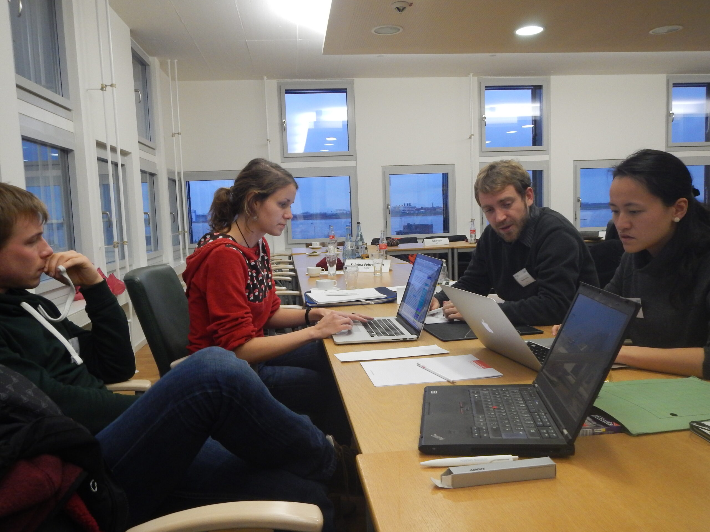

This year’s annual meeting of the Helmholtz Juniors took place at the Alfred-Wegener-Institut (AWI) from the 14th to the 16th of January. New Helmholtz Juniors were introduced. We re-formed our working groups, elected new speakers and had interesting discussions and a nice time.

On Wednesday afternoon, the last year’s speakers Nicholas Engel and Sripriya Murthy welcomed the previous and new Helmholtz Juniors to the meeting. The speakers of last year’s working groups presented their work and achievements and suggested topics for 2015. The survey group has finished the first evaluation of the 2014 survey. The evaluation is currently discussed and will be released roughly within the next two months. Further groups are “communication”, “event”, “working conditions” and “steadification”. See our homepage (www.helmholtz.de/hejus) for details on these groups. In the evening, the new Helmholtz Juniors chose their working groups. The groups of 2014 will be kept in 2015 and no new ones were established.

The second day started with a talk of Karin Lochte, head of the Alfred-Wegener-Institut, followed by a question and discussion session with her. After taking our group picture (the cover picture of the entry) we got a guided tour on the work of the AWI. Before lunch we met with Claudia Hanfland who coordinates the POLMAR graduate school (polmar.awi.de) and currently represents all Helmholtz graduate schools as their speaker. We discussed about the relevance of graduate schools and their function.

In the afternoon, we had group working sessions in which the previous group’s speakers handed over their work to the new members. The first hours of group work were quite productive and we collected lots of new ideas and plans for 2015. Have a look on the picture of our group work sessions below!

We started on Friday with group working sessions and with electing group speakers. After that Xixi Feng presented PhDnet (www.phdnet.mpg.de) which is the PhD candidate representation of the Max Planck Society. She is one of the speakers of PhDnet. There are some intersections in the topics on which HeJu and PhDnet work such as regular contracts instead of scholarships. Therefore we started sending speakers to each other’s annual meetings.

The last points on the agenda were the elections for the two HeJu speakers of 2015 and the decision on the location for the next year’s annual meeting. Daniel Neumann (Helmholtz-Zentrum Geesthacht) and Meike Köhler (Helmholtz Zentrum München) were elected as speakers. The next year’s meeting will take place at the Deutsches Zentrum für Luft- und Raumfahrt (DLR) in Oberpfaffenhofen, close to Munich.

We would like to thank Renate Degen very much for organising the event in Bremerhaven. Also, we would like to thank the Helmholtz Association and the Alfred-Wegener-Institut very much for their financial support and for offering a location.
