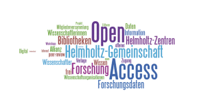

Open Access describes a development over the last 15 years, which set the target to make science available to everybody without any charge. Since Open Access is such a great success, I want to give a short overview about history, different types to realize Open Access and the future development from Open Access to Open Science.

**A brief look backwards**

For more than ten years, the thought of open and free accessible research has been developed in the science landscape. A first big point was the “Berlin Declaration on Open Access to Knowledge in the Sciences and Humanities”[\[1\]](#_ftn1) in 2003, which was signed by the largest German research organizations like Helmholtz Association, Max Planck Society, Fraunhofer-Gesellschaft or Deutsche Forschungsgemeinschaft DFG and by international research organizations like Centre National de la Recherche Scientifique (CNRS) or Institut National del la Santé et de la Recherche Médicale (INSERM). With this Berlin Declaration the major research organizations in Germany voted for Open Access in Science. Since then different declarations and guidelines for Open Access have been published. For example, the G8 Science Ministers declared at their meeting in June 2013 in London “We share the intention, therefore, to continue our cooperative efforts and will consider how best to address the global promotion of increasing public access to the results of publicly funded published research including to peer-reviewed published research and research data.”

The European Commission made Open Access a general principle of EU’s Research & Innovation funding programme for 2014-2020, Horizon 2020. Thus, all articles produced with funding from Horizon 2020 will have to be available via one of the two recommended types of Open Access:

**The golden way**

The golden way of Open Access describes research publication in Open Access Journals. These Journals are accessible without any charge for the reader. Different Open Access publisher compensate the lack of subscription fees by different ways, such as funding organisations or article processing fees (the author’s institution pays for publishing).

**The green way**

The green way describes the possibility of a so-called secondary publication. About 80 % of all journals of STM publisher (Scientific, Technical and Medical publisher) allow, with some restrictions, a publication of the accepted manuscript via an institutional repository, which makes the paper publicly available. This secondary publication must have the same content but do not need the same type setting. A typical restriction is a moratorium which has to be kept before publishing the paper a second time. Whether the secondary or primary publication is used for further research, you always have to cite the primary publication.

In Germany, the Bundestag supports secondary publications with a change in “Urheberrechtsgesetz”. With the made change, a research paper can be secondary published after 12 months, whether the publisher agrees or not, if the following points are met:

- The research was funded publicly by at least 50 %
- The journal is published at least twice a year
- The secondary publication will not serve a commercial purpose.

For the sake of completeness, I should mention that traditional publisher try to keep up with Open Access and offer the possibility to make your paper publicly available within a subscription journal. But you have to be careful with this so called hybrid solution: You will have to pay higher article processing fees than in Open Access journals and your institution will pay nevertheless subscription fees to offer all other papers form this journal to you. Furthermore the green way is possible in most cases.

**Keep Open Access in your mind**

Making science available for a larger community via Open Access is an ongoing process. Open Access has a great support from different research organizations to political institutions up to the EU and G8. It is always worth to consider the possibility to publish the golden way or, at least, push the secondary publication via the green way. Within the Helmholtz Association the working group Open Science informs you about all possibilities of Open Access in general and provides contact information to all the working group members at your institute: [http://oa.helmholtz.de/](http://oa.helmholtz.de/)

**A brief look forward**

Open and free accessibility of research paper is on the move. However, research is not only done by writing a paper. It contains also collected data and written software to process the data. This is clarified by the term of Open Science. There are more and more efforts to make data accessible for example worldwide databases like the World Data System WDS[\[2\]](#_ftn1) or the Data repository PANGEA[\[3\]](#_ftn2). Additionally, it is also possible to publish data as supplementary to a research paper and do this via a data repository of your institution.

[\[1\]](#_ftnref1) http://www.icsu-wds.org/

[\[2\]](#_ftnref1) http://www.helmholtz.de/mediathek/reden/artikel/4/federal\_government\_offers\_prize\_for\_responsibly\_acting\_enterprises/

[\[3\]](#_ftnref2) http://www.pangaea.de/
