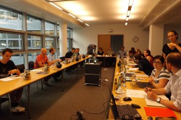

On the 20th and 21st of July, the Helmholtz Juniors Mid-Term Meeting took place at the Helmholtz Association's Head Office (HGF) in Berlin. It was the second Mid-Term Meeting ever and proved to be a great opportunity to meet each other again, to discuss the latest progress and problems, and to improve the cooperation of the Helmholtz Juniors.

On Monday, the first day of the meeting, we were welcomed by Caroline Krüger from the Helmholtz head office. The working phase was opened up with presentations from all Helmholtz Juniors working groups on the activities of the last half year and on future plans for the upcoming half year. Afterwards two guests from the Helmholtz Head Office gave a parallel session on two of the main topics we deal with. Elsbeth Lesner was guest of a discussion round on working conditions, PhD contracts and stipends. Jennifer Schevardo gave a firm presentation on different networks within the Helmholtz Community with a focus on the new “Helmholtz & Friends” Alumni network. “Helmholtz & Friends” aims to strengthen the Helmholtz-Feeling within the Association and initiates the build-up of a new network of peers that provide exchange of knowledge basically concentrating on social skills and leadership ([Helmholtz & Friends](http://www.helmholtz.de/helmholtz_friends/)).

After lunch – a delicious one by the way – our next guest was Sabine Helling-Moegen, the administrative head of the German Center for Neurodegenerative Diseases (DZNE). She gave a brief overview of the history of the German “Großforschungseinrichtungen” and of the the Helmholtz Association and described the process from narrow research topics towards nowadays program oriented research and the program oriented funding (“Programmorientierte Förderung”, POF). The interesting talk and the following discussion gave us the opportunity to gain a better understanding of mechanisms and politics in science and education in general and in the Helmholtz Association, in particular.

The last part of the first day was dedicated to a discussion on an overall strategy of the Helmholtz Juniors and on tasks for upcoming half year and their priority:

- focus for the working conditions group: reduce number of in-house stipends and increase number of vacation days to 28 or 30
- improve the motivation of all PhD students to be part in the local PhD representative initiatives and in the Helmholtz Juniors.
- enhance visibility of the Helmholtz Juniors: Only if we are visible, we can change something.
- strengthen the connection to the HGF head office
- strengthen our network to other groups which work for improving working conditions in science
- improve continuity after handover to new Helmholtz Juniors

The first day was concluded with dinner in a nice restaurant in Berlin‘s center.

The second day of our Mid-term meeting was dedicated towards group work. The working conditions group recapitulated their meeting with Elsbeth Lesner from the previous day. The Event group started planning a Helmholtz PhD day which should take place in 2016. Both, the Survey and the Communications working groups attended an Q&A session with Jan-Martin Wiarda, Bianca Berlin and Janine Tychsen from the Helmholtz Communications and Media Relations Office. The three of them were faced with several questions on internal and external communication issues. Besides receiving useful answers, possible contacts for our communication-related issues, and insight into the current projects of their group, we were encouraged to raise a critical voice inside and outside of the Helmholtz Association whenever necessary.

With a wrap-up and a basket of tasks for the upcoming months, we finished our Mid-term meeting in the early afternoon.

At this point we, the Helmholtz Juniors, want to thank all our guests, the Helmholtz Association's Head Office and the events working group. The meeting was a great success and will motivate us and enhance our future work.
