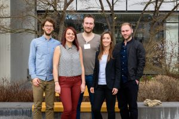
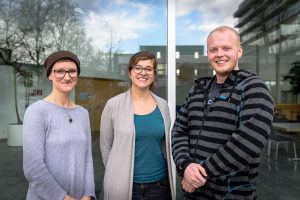

**Same time of year, different Helmholtz center!**

At the beginning of the year, in February, the Helmholtz Juniors annual meeting took place in the beautiful Heidelberg, where the old city and the state-of-the-art cancer research facilities of the [German Cancer Research Center](https://www.dkfz.de/en/index.html) (DKFZ) meet! Thirty-four representatives from all Helmholtz centers joined the 3-days meeting. We were fortunate that the spokespersons of [Max Planck PhDnet](https://www.phdnet.mpg.de/) and [Leibniz PhD Network](https://www.leibniz-gemeinschaft.de/en/careers/the-next-generation-of-researchers/leibniz-phd-network/) joined us.

The DKFZ was very hospitable. During the meeting, the [graduate program](http://www.dkfz.de/en/phd-program/) director, Dr. Lindsay Murrells, introduced the research at DKFZ and its graduate school to us. On the DKFZ campus, there are 3,000 personnel working on cancer research, 540 of which are doctoral researchers. She also introduced us to the various services that the [career center](http://www.dkfz.de/en/career-service/Careers.html?m=1487783040) provides for both doctoral researchers and [Postdocs](http://www.dkfz.de/en/postdoc-program/index.html).

We had a very special tour in two of the most modern facilities for cancer research and treatment in Europe, the [High-Field Whole Body MR (7 Tesla)](https://www.dkfz.de/en/medphysrad/workinggroups/ultrahighfieldmr/ultrahighfieldmr.html) and the [Heidelberg Ion Beam Therapy Facility (HIT)](http://www.klinikum.uni-heidelberg.de/index.php?id=112189&L=en). Thanks to the arrangements of DKFZ HeJus, Danja and Elias, we also enjoyed our time in the old town of Heidelberg. Photo credits go to Elias.

**What we achieved in 2016:**

At the beginning of the meeting, [Dagmara](http://blogs.helmholtz.de/hejus/2017/02/meet-dagmara-and-elias-our-spokespersons/), HeJus Spokesperson in 2015/16, pointed out that one of the HeJus' goal is to improve doctoral researchers' working conditions, yet the occasion to hear them out are limited to the survey and the NextGen conference. She said, "If we cannot hear from them, we cannot help them." What we achieved and plan to achieve clearly reflect this goal.

The HeJus are organized into 4 working groups: **working conditions, survey, communications, and events**. On the first day, the speakers of each group reported on what their groups have accomplished in 2016. No surprise there, the achievements were astonishing! The events group reported on [NextGen 2016](https://blogs.helmholtz.de/hejus/2016/11/nextgen-2016-conference/), the first German-wide meeting of Helmholtz doctoral researchers. We also met members of the dedicated team of talented PhD students at GEOMAR, Kiel organizing NextGen. The group also gave us a glimpse of then preliminary **[program](https://www.helmholtz.de/en/about_us/press_and_media/events/nextgenhelmholtz_2017/program/) of NextGen@Helmholtz 2017 in Kiel**.

The working conditions group has worked with all HeJus for years on the most optimal **working conditions statement**: "65% TVöD E13 payment, 30 days of vacation, and a contract of minimum 3 years from the beginning with the doctoral project as the main job objective." The working conditions group sent their statement to [Prof. Dr. Otmar D. Wiestler](https://www.helmholtz.de/ueber_uns/die_gemeinschaft/praesident/), the President of the Helmholtz Association. Prof. Wiestler kindly offered his time to respond to the statement (we will publish his response in a following blog post). All HeJus has sent the statement to their respective directors, and Lisa, the HeJu from GEOMAR, has shared with us a remarkable success story. GEOMAR Dokteam has met with the Director, [Prof. Peter Herzig](http://www.geomar.de/en/mitarbeiter/d/pherzig/), concerning the statement, and within 1 month **GEOMAR changed the status of 13 in-house and Max Planck stipend holders into 75% TVöD contracts**.

As part of the largest research association in Germany, and believing that science is not isolated from the political and societal scenes, the working conditions group also prepared a **questionnaire and sent it to the main German political parties** about their views on scientific research. The HeJus are awaiting for the answers which will be publicly available to guide the German voters prior to the elections in September, 2017.

The efforts of HeJus spokespersons in 2015/16 Dagmara and Elias have secured the HeJus **a budget of 50,000 EUR per year for 3 years**. The spokespersons are the contact point and external representation of the HeJus. They communicate regularly with other PhD networks and with the Helmholtz Association. We now have a direct contact at the headquarters to [Dr. Johannes Freudenreich](https://www.helmholtz.de/en/jobs_talent/funding_programs/doctoral_students/), who is known for his efforts promoting of young and early researchers with focus on postdocs, supervisors training and the newly formed international research schools.

The survey group shared with us the news that they have finished preparing **the 2017 survey**. The available budged allowed them to run the survey on a secure platform. The survey covered many issues that are integral to the doctoral researchers such as: funding, supervision, graduate schools, working conditions, career plans, and infrastructure.

And finally, all the updates, news, events and outreach have been brought to you by the communications group! We communicate the HeJus news to you through our various channels: the **blog,** [Facebook](https://www.facebook.com/helmholtz.juniors/)**, [Twitter](https://twitter.com/HelmholtzJrs)** and [LinkedIn](https://www.linkedin.com/company-beta/17993833/) . We report on the various events that HeJus take part in. We also outreach for new HeJu members and introduce HeJus working groups to them.

**What we will achieve in 2017:**

On the second day, we went on preparing our plan for 2017. The highlights are:

[Network of Networks (N^2):](https://twitter.com/HelmholtzJrs/status/839768720243322880) The HeJus, Max Planck PhDnet and Leibniz PhD Network have been in close contact and exchange of experiences since the beginning of each of them. Now they formed N^2, a network for all doctoral researchers at all non-university research organizations in Germany. The first participation of N^2 was at the [March For Science](https://blogs.helmholtz.de/hejus/2017/05/march-for-science/). N^2 plans joint events and call for interested doctoral researchers to participate in it. Stay tuned to know more about N^2 formation and activities here on the blog soon.

NextGen@Helmholtz at GEOMAR: NextGen is very special because it is an exclusive event of Helmholtz Association doctoral researchers. It has a unique nature as a multidisciplinary meeting. Its program includes a certificate-based science communication training. The alumni session is meant to provide the now students with various ideas of what is after-PhD. Through NextGen, we know about facilities at other Helmholtz Centers for perhaps future collaborations. Because of that all, the Hejus communicated to the graduate schools at all the centers to provide financial support and credit points for their doctoral researchers registering for NextGen.

**The Speakers:**

With their enthusiasm and expertise, we elected Giulia and Konstantin as the HeJus spokespersons for the year 2017. Giulia Caglio [[Max Delbrück Center for Molecular Medicine](https://www.mdc-berlin.de/) (MDC), Berlin] has been a member of the HeJus communications group. You certainly read her blog posts [here](http://blogs.helmholtz.de/hejus/about-the-authors/). In the DokTeam, Giulia was proactive and had a sense of responsibility to improve the working conditions at her institute. She plans to pursue the same as a spokesperson of the HeJus. Konstantin Kuhne [[Helmholtz-Zentrum Dresden-Rossendorf](https://www.hzdr.de/db/Cms?pNid=0) (HZDR), Dresden] was the HeJus treasurer for the past year. He gained an overview on the organization within the Helmholtz Association. We will hear from them here on the blog, and from the newly elected treasuress Lara Grünig from the [Helmholtz-Zentrum Geesthacht Centre for Materials and Coastal Research](https://www.hzg.de/index.php.de) (HZG).

But what does that meeting mean for "non-HeJus"? We have a few recommendations in that regard!

1. Now officially in all HeJus documentations and communications we are all called **“Doctoral Researchers”**! A term that precisely describes our day-to-day job at the largest research association in Germany, and empowers us to achieve it.

2. The doctoral researchers are 50% of the working force at the Helmholtz Association and a significant fraction of the scientific output and publications is produced by doctoral researchers. The working conditions and survey groups **need your input** from all the centers and to react upon it to improve the contracts and working conditions of the students.

3. Stay tuned for a series of **interviews and interesting research project from all the Helmholtz centers** here on the blog!

4. Ask the HeJu representatives of your center and your graduate school for our **"Why to become a HeJu?" flyer**. Consider becoming the HeJu representative of your center in the next elections.

5. **Get involved!** If you missed NextGen 2017 registration, [like us](https://www.facebook.com/helmholtz.juniors/) and be ready for N^2 events and NextGen 2018!
