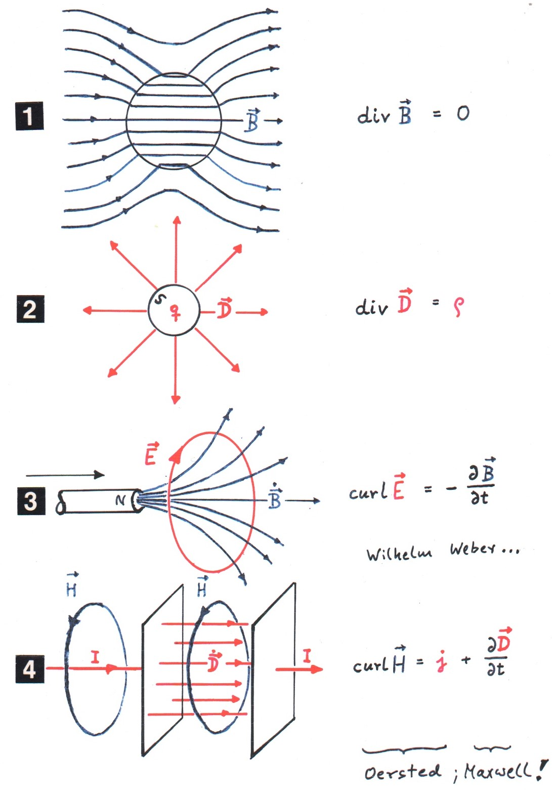

Today, we have a post from guest author [Prof. Reinhart Claus](http://www.reinhartclaus.de/index.html) a physicist, enthusiastic astronomer, and musician.

 

_**"Electric Displacement and Maxwell's Equations - Why and how?"**_

Our modern understanding of all electric phenomena more or less starts with Maxwells equations from 1865 (Fig. 1 – 4). That there were no magnetic monopoles in fact was known earlier (1) and that electric charges are the sources of „force lines“ as well (2). The essentials of the induction law (3) were known and also Oersteds detection that an electric current creates a rotating magnetic field around it had been published, left part of (4). But why did Maxwell then find it necessary to introduce the electric displacement in the form of the second term in (4)?

Maxwell studied Faraday's publications very carefully and he also recommended this to all physicists. - An old question was: „Why does a magnet attract a piece of soft iron in a certain distance according to Newton's „actio = reactio“– law (5)? The well known experimental answer was: „The soft iron piece is transformed to become a magnet itself (6).“ Faraday now stated that the initial magnet impossibly could change properties of an object at a larger distance while ignoring all closer locations. And in fact if we put iron filings in between again all fluff individuals become small magnets arranging themselves along what then was still called force lines (7). The frenchman La Hire published this as early as in 1717. Faraday therefore started systematic experiments in order to try if the situation is analogous in electricity.

A charged object polarizes an insulator at some distance (8). We call it „influence“, Faraday still named it „induction“. In order to study the role of space he therefore filled the gap between the two conductors of a spherical condenser with different insulating materials. The use of a „spherical“ arrangement eliminated disturbing border effects! All these „dielectrics“ altered the field in the gap in a well defined way(9). Therefore Faraday finally also tried what happens in vacuum – and really even in that case influence took place. Vacuum was electrically active too and obviously very much different from just „nothing“!

Both magnets and dipoles arranged as in the upper part of (10) were known to exhibit longitudinal attraction and transverse repulsion. Faraday generalized this to yield also for force lines themselves. That force lines tend to contract can be directly observed as the attraction between two charged metal plates of an plane condenser. But what about transverse repulsion? A local concentration of charges on condenser-plates as shown to the left in (10) is known not to be stable. Charge distribution will rather change to become uniform as in the right figure. We use to interprete this as a consquence of charge repulsion on conducting surfaces (or even more sophisticated as a consequence of equipotentials). Faraday, however, regarded it as a prime consequence of force lines transverse repulsion – and found the proof for this interpretation in the outbulging field at borders where no charges explicitely do exist!

Maxwell read all this and finally realized that vacuum just should be regarded as a special kind of dielectrics. This means that materials due to their polarization always transform an electric field E into a „displacement field“ D = ε ε₀ E where the vacuum situation just is the particular case with ε = 1 (written in our modern nomenclature). A varying charge displacement in time therefore would behave just as any other electrical current. - This was the simple, bright and extremely successful idea!

In 1845 Faraday after many stressing efforts finally found the famous effect now bearing his name: The plane of linearly polarized light passing along the axis of a glass rod was rotated by a magnetic field originating from the electrical current through a coil around it. Maxwell considered what this does mean to magnetic force lines as such.

We must now take into consideration that physics in the 19th century still was dominated completely by mechanics. William Thomson, the late Lord Kelvin e. g. stated: „I never satisfy myself until I can make a mechanical model of a thing. If I can make a mechanical model, I can understand it. As long as I cannot make a mechanical model all the way through I cannot understand it.“ It was in this context that even Ludwig Boltzmann constructed a perfect mechanical model to demonstrate Faraday's electromagnetic induction. (It still exists in the university of Graz, the author has seen it working!) So it takes no wonder that also Maxwell started on this path in 1861-1862.

Maxwell thus began to regard the magnetic field as a conglomerate of flexible rotating, narrow tubes representing force lines (11). A rotating experimentally observed phenomenon might be transmitted only by field features rotating in screw form by themselves! He imagined the field strength not to be represented primarily by angular velocity but rather by the peripherical linear velocity of these tubes. An increasing radius of the tubes therefore would directly stand for Faraday's transverse repulsion of the lines. The best corresponding mathematical model for all this existed in hydrodynamics at the time – and Maxwell was familiar with it, last not least because simultaneously his colleague Georges Stokes was active in Cambridge. Maxwell consequently tried to „translate“ hydrodynamics into a new language in order to find a coherent mathematical description for all electro-magnetic phenomena. Density for instance was replaced by permeability so that finally the „curling magnetic energy“ became proportional to the square of the field strength, and also a plausible form of Coulomb's experimentally verified law was achieved. One very serious problem, however, still existed with this model: Friction between uniformly rotating tubes in direct contact (11)! The well known solution with e. g. cogwheels in contact is the introduction of a compensating idle between neighbors. In the case of the magnetic tubes a large number of small balls - very small spheres with hardly any mass - could achieve a similar result (12). And all these idles around magnetic tubes would finally represent electric materia! - Note, that the idea of electrons, not to speak about their spin then still was very far away in future! – Constant rotation of the field-tubes with all balls essentially keeping their position in space represented a permanent magnet. The surprising fact with the idea, however, is that a local drift of this „ballgas“ perpendicularly to the tubes could induce (additional) rotation and thus represent Oersted's experiment - the reverse procedure with peripherically accelerating tubes on the other hand Faraday's induction of an electric current.

This was the almost unbelievable start! - None of all these for us strange and somewhat crude ideas appear in Maxwell's later publications, especially the famous „Treatise“ from 1865 any more. The mathematical formalism there became consistent by itself. It finally covered much more future Physics than Maxwell himself maybe ever realized!"
