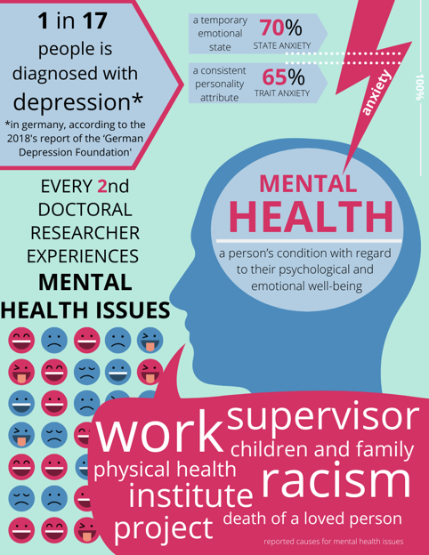

### Mental Health – Why do we care?

The mental health of Doctoral Researchers has been increasingly analysed during the last years, often with alarming results. Major concerns regarding the well-being of early career researchers are depression, anxiety, harassment and a difficult work-life balance.

 

**What do studies say?**

The Graduate Assembly (2014) reported that 47% of Doctoral Researchers of the University of California, Berkeley met the threshold for depression. A recent study by Levecque et al. (2017) analysed the situation of more than 3000 Doctoral Researchers in Belgium and found that the risk for psychiatric disorders in academia is higher than in other highly-educated groups. 32% of Doctoral Researchers are at risk of a common psychiatric disorder, such as depression. Main reasons were work-family interfaces, job demands and job control, and the leadership style of the supervisor (Levecque et al., 2017).

In a Nature study, 29% of 5700 Doctoral Researchers listed mental health as an area of concern, with half of them getting help for depression or anxiety caused by their PhD study (Woolston, 2017). A follow-up Nature study in 2019 showed that things seem to get worse; 36% of 6300 PhDs from all around the globe seeking help for depression and anxiety related to their PhD project. Also, one-fifth reported bullying, while another fifth experienced discrimination or harassment (Nature, 2019).

The EPFL Doctoral III survey (2019) draws a similar image, 20.7% of the 1043 participating Doctoral Researchers experienced **bullying** or behaviours that may constitute as bullying, which includes aggressive behaviour, being undermined and being isolated and ignored by people at work. Symptoms of depression were associated with experienced bullying behaviour. If there is evidence of bullying more than 90% of respondents showed depressive symptoms (EPFL, 2019). Another reason for the critical mental health situation is that success is measured in publications, citations, funding and impact. The autonomy of research is reduced or removed when funding, publications and impact are part of the universities formal monitoring and evaluation system, and when supervisors judge the failure or success of Doctoral Researchers (Nature, 2019).

 

**What did we find?**

 ****

During the 2019 Helmholtz Juniors survey, we tried to get an overview of the mental health of all Doctoral Researchers within the Helmholtz Association. The survey used a shortened STAI questionnaire. The high number of working hours - 66 % work more than 41h while even 18 % work more than 50 h a week - and high conflict potential - 16 % reported conflicts with superiors are critical influences on the mental health of young Doctoral Researchers.

Analysis of the questionnaire indicated 22 % showed signs of moderate to severe depression and 70 % showed signs of moderate to high state anxiety.

The results are, sadly, similar to the findings of the already presented studies.

But the first step on finding solutions and ways to tackle a problem is knowing about it in the first place!

We´re working on various strategies, as Helmholtz Juniors on our own, as well as in joined projects with individual centres and of course with the Helmholtz Association’s Headquarters in Berlin.

 

**And we would like to hear your opinion on that topic!**

What do you think are the biggest challenges for keeping a good mental Healh while doing your PhD or in science in general?

Have you encountered a hostile workplace atmosphere?

Do you want to help us create a more sustainable work environment in academic research?

 

**We would love to hear your thoughts and ideas!**

 

All the best!

The Mental Health Awareness Month post series is brought to you by Helmholtz Juniors

We thank Pedro Ivo Silva Batista (DESY), Martin Schrader (HZDR), Michaela Löffler (UFZ), Nicolas Stoll (AWI), Fabian Wolf (GEOMAR), Younes Bouhadjar (FZJ), Stephanie Taylor (DZNE), Khwab Sanghvi (DKFZ), Lukas Kreis (GSI), Johannes Nelles (UFZ), Vasundhra Shaw (DESY) and Olya Oppenheim (MDC) for the text and Marlene Härtel (HZB), Martin Schrader (HZDR), Anna-Lena Amend (HMGU) and Xin You (UFZ) for the design.

**Follow us and keep up2date with our work!**

[https://www.helmholtz.de/karriere\_talente/wissenschaft/promovierende/helmholtz\_juniors/](https://www.helmholtz.de/karriere_talente/wissenschaft/promovierende/helmholtz_juniors/)

[https://www.facebook.com/helmholtz.juniors/](https://www.facebook.com/helmholtz.juniors/)

[https://www.instagram.com/helmholtz.juniors/](https://www.instagram.com/helmholtz.juniors/)

[https://twitter.com/helmholtzjrs/](https://twitter.com/helmholtzjrs/)
