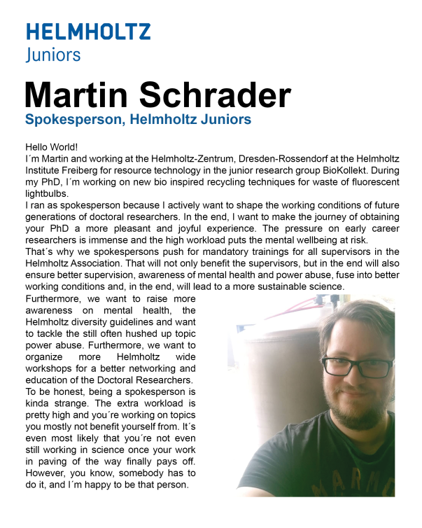

During our HeJu annual meeting 2021 (online) on 28th Jan, we elected our new HeJu [steering committee](https://www.helmholtz.de/en/jobs-talent/science/phd-candidates/helmholtz-juniors/) as well as [working group](https://www.helmholtz.de/en/jobs-talent/science/phd-candidates/helmholtz-juniors/working-groups-activities/) speakers for the term 2021-2022.

We thank our previous steering committee - [Michaela](https://www.ufz.de/index.php?en=43868), [Isabela](https://www.uni-heidelberg.de/alumni/research-alumni/2020/01/en/cisneros.html) (spokespersons) and Kevin (treasurer) - for their excellent work to unite us through the pandemic year and fight for the rights and well-being of doctoral researchers (Beside our center-based campaigns, you can find examples of our public outreach here: [survey results](https://www.helmholtz.de/fileadmin/user_upload/06_jobs_talente/Helmholtz-Juniors/Survey_Report2019_update.pdf) and [outreach](https://www.youtube.com/channel/UClP8L4lfDVwCk2HScaJA6qg/featured), [mental health](https://blogs.helmholtz.de/hejus/category/heju-mental-health-awareness-month/), [level-up webinar series](https://www.helmholtz.de/fileadmin/user_upload/06_jobs_talente/Helmholtz-Juniors/LevelUp_Webinar__series_Flyer.pdf), [media coverage](https://www.nature.com/articles/d41586-021-00233-6)).

Looking into 2021, we are very proud to present you our newly elected steering committee as well as working group speakers in a post series.

And here we go: Let's meet **Martin Schrader**, our new spokesperson for 2021/2022.

