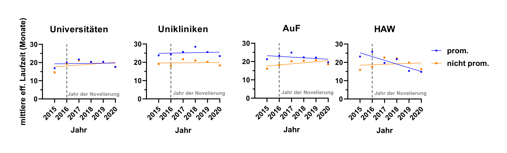

Most organizations in this world recognize when they are in a crisis, and they either overcome these crises or seize to exist. The German scientific system is in such a crisis but does not seem to recognize it. It’s a crisis of wasted potential, a crisis to the detriment of those who help to carry the system. From the outside, science in Germany appears to be continuous and reliable, but this façade only hides serious problems. For example, Doctoral Researchers (henceforth DRs) disproportionately often suffer from depressive symptoms (our studies: [Leibniz](https://leibniz-phd.net/survey-2019/), [Helmholtz](https://www.helmholtz.de/karriere/karriere-bei-helmholtz/promovierende/helmholtz-juniors/survey/) und [Max-Planck](https://www.phdnet.mpg.de/145345/2_PhDnet_Survey_Report_2019.pdf)). These DRs are the undisputed backbone of the German scientific system. Moreover, together with Postdocs, they compose the majority of scientific staff. Nonetheless, their needs, worries and fears find comparatively little consideration when it comes to the design of structures and organizational culture in science. This way, a lot of potential remains unused.

_How productive could our research be if the system granted its scientific staff an adequate working environment? How much potential could we utilize?_

Science is primarily mental work. But especially mental capacities are negatively impacted by uncertainty and anxiety about the future. Currently and in most cases, the working conditions of DRs and Postdocs are regulated by the WissZeitVG -a law that is meant to set the general framework for scientists’ temporary employment conditions. In 2016, this law was amended and today the evaluation of this amendment has been published ([evaluation report](https://www.bmbf.de/SharedDocs/Downloads/de/2022/abschlussbericht-evaluation-wisszeitvg.pdf?__blob=publicationFile&v=2)). The primary justification for any temporary contract according to the WissZeitVG is “qualification”, a term which is, however, legally not closer defined. And that’s already this law’s core issue. Most institutions (56.8%) have not developed any guidelines for qualification goals (Figure 10 of the evaluation report). We do not doubt that the time of doing a doctorate is a qualification phase. However, when scientists enter the Postdoc phase, it is already more difficult to define the qualification goals.  For that matter, in most cases, habilitation is used as justification (56%, Table 13 of the evaluation report). This appears absurd considering that only a minority of those scientists can receive a professorship (max. 3% of Postdocs).

The primary goal of the WissZeitVG 2016 amendment was to prohibit “inappropriate short-term contracts” and to create a reliable framework for the limitation of work contracts. Unfortunately, this goal has not been reached. After a brief period of time (2015 - 2017), in which average effective contract durations became longer, there appeared to be a relapse from 2017 to 2020 such that contract durations went back to the same level that was observed prior to the amendment. In case of PhD staff of non-academic science organizations (AuF) and of the university of applied sciences (HAW), average contract durations even decreased from 2015 to 2020 (Figure 1). The stipulated contract durations are not appropriate for DRs either. In their case, average effective contract durations are at 20 months regardless of the organization, even though the average doctoral research project actually takes 4.7 years, thus 55 months, in Germany ([Buwin](https://buwin.de/dateien/buwin-2021.pdf); Abb. B46). In sum, this evaluation depicts that inappropriate short-term contracts are still the norm in science.

Durations of projects financed through third parties usually are longer than the respective work contracts (Figure 58 of the evaluation report). Therefore, employers are not fulfilling their duty, which is specified in WissZeitVG §2 Passage 2, where it says that the "[...] stipulated contract duration shall correspond to the project duration".

These poorly projectable and uncertain working conditions lead to anxiety about the future, self-exploitation and, eventually, to psychological stress for DRs and Postdocs.

The consequence is that many clever minds are leaving science, taking their ideas and methods with them. The holes they leave behind will become noticeable.

Which potential is hiding in our scientific institutions? We don’t know! To allow for good research, a good foundation needs to be set. In light of the challenges, which will concern us in the 21st century, and already concern us, we need the best possible scientific apparatus. This starts with the scientific staff and their working conditions.

Co-author: Jacob L. Gorenflos López (FMP Berlin and advisory board member of the WissZeitVG evaluation)
