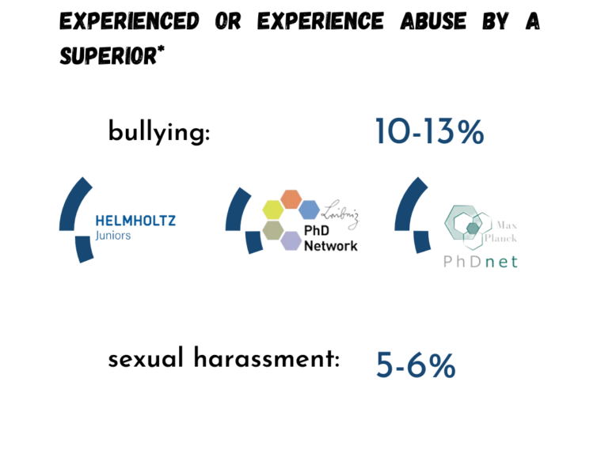
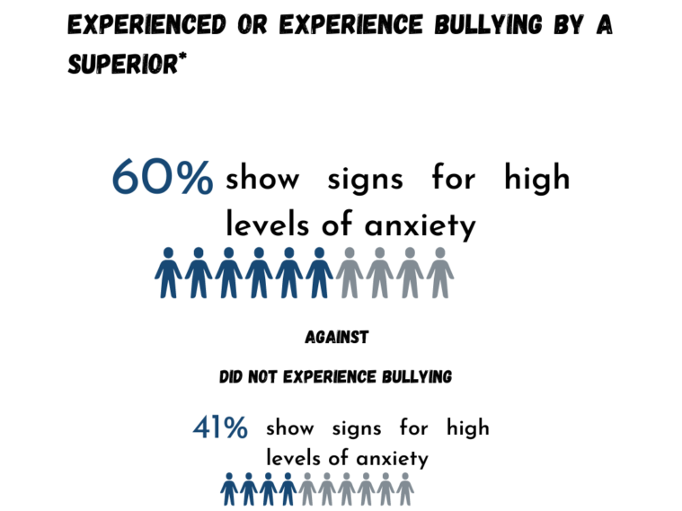
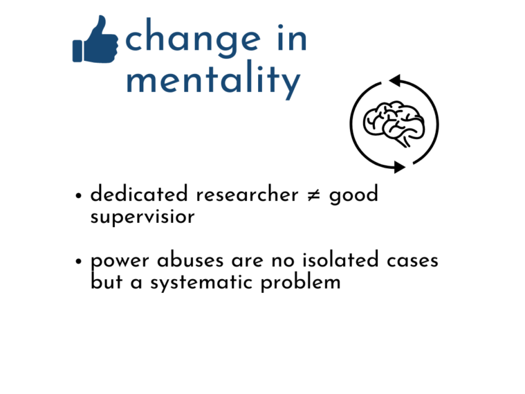

**Mental Health Awareness** is a concern all year long.

But in some countries May is the Mental Health Awareness Month, in other its October. We want to use both!

For May we have something different prepared. The [Mental Health Paper](https://www.universitaetsverlagwebler.de/_files/ugd/7bac3c_6974dfc41c054e3b94ff8590718fe819.pdf) by [Ivona Kafedjiska](https://de.linkedin.com/in/ivona-kafedjiska-227166ba?trk=public_post_share-update_actor-text&original_referer=https%3A%2F%2Fwww.linkedin.com%2F), Lea Heckmann, Vanessa Pires, [Pankhuri Saxena](https://www.linkedin.com/in/pankhuri-s/) & Jana Lasser made quite an impression amongst the community this year \[1\]. Our post summarizes the most important parts of each subtopic included in the paper.

2nd part of the series: **Supervision**

 

 

References:

\[1\]    Kafedjiska, I., Heckmann, L., Pires, V., Saxena, P., & Lasser, J. (2022). The Mental Health Crisis among Doctoral Researchers – Findings and Best Practices. _Zeitschrift für Beratung und Studium_, _17_(1), 1-7.

Images: Jakob Rauscher, Aniket Raje
