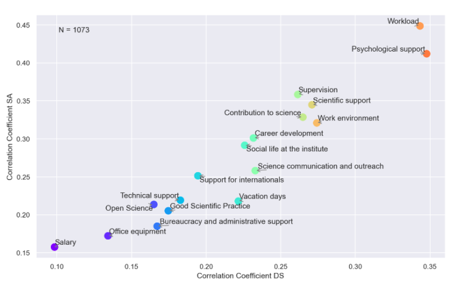

#### A tale of work-life-balance

The day of a doctoral researcher (DR) consists of 9 h of work on average (according to N² Survey 2021). Contracts (or at least the paid part of them) only cover a fraction of that – most contracts cover about 6 h of work per day. Adding stress of having to publish, giving presentations, and other deadlines, the expectations of science do not leave much room for anything beyond. However, the workload of DRs is the biggest inducer of anxiety and followed closely by depression (see figure below). The lack of a good work-life-sleep balance is a key factor for a healthy life in the long run, but seems to be neglected during the doctoral research phase.

#### 

Work-life balance is nothing new to me. My stuttering taught me at an early age that I need breaks from stress. If I don’t comply, if I don’t relax, it will just get worse. A simple equation. A simple reflection of my well-being – a reflection that I am not able to hide. That means that I need somewhat more time to relax and can not simply power through stressful periods without worsening my stutter. Current times supervisors expect you to work over 100 %. At the beginning of my doctorate, I tried to comply to it but failed miserably. I found myself at 6 to 7 hours per day – and sometimes extra hours on a Saturday. To that fragile balance I added a spokesperson-ship with the  Helmholtz Juniors...

Reactions from others were mostly the same: “Oh so you like pain?”, “You will never finish your project when you only look at the contract hours.” or “If you continue your voluntary work, you’ll lose focus for your project”. Being a member of the works council is a good thing, being part of the internal scientific board is an honour, but taking on similar roles as a DR should be kept for your free time or better not taken on at all...

For me, this just made one problem obvious – a missing balance. The qualification phase should not only look at research but to educate academics, future supervisors and leaders. Meaning, most projects are just too big and the result is a high workload which is only manageable with the sacrifice of time one would need to recharge or to educate themselves.

In my opinion, these sacrifices would be totally avoidable if the qualification phase would not only include time for the project. The time for education, networking and gaining soft skills should not be something for our free time as it is part of the job – not an extra weight on your shoulders. The institute shoves education to the university as its their job to do so. But if I am expected to work 40 and more hours per week on my project, how am I supposed to work on my soft skills as a DR? When do I have time to network when I don\`t get the time off to attend events with other DRs? When do I get time to recharge when I have to take vacation for educational courses? When can I relax when I am expected to write reports during my vacation? When does it all make sense?

An average of >40 h of work per week, an average of 4.5 years until the defence, 41 % of people don’t feel free to take vacation due to high workload or pressure from the supervisors. All these and more are facts among our DRs (according to the N² Survey 2021). Numbers of a missing balance, numbers of imbalance towards work.

A Covid infection made this imbalance real to me. Out of order for two whole weeks, and my ability to focus vanished for a few more weeks. A full break for everything. Only then, I noticed how bad my stuttering got. I had not focused on myself for months on end, time to recharge always got cut short to finish mails, experiments or presentations. And now I got my limits shown to myself.

So who is responsible for the “life” in work life balance? Most institutes don\`t care, most universities don\`t care, most supervisors don\`t care, most group leaders don\`t care. It's you. You have to care. Care for yourself. Care for your peers. You have to take the time you need to recharge, take time for education, take time for networking, take what is rightfully yours. It is not your fault the projects are not planned accordingly, but its your responsibility to care for your health.

Stay home when you are sick (check out „Vakanztage“, most institutes have it), go home when you loose focus, go home when you are tired and take your peers with you. Leave your laptop at home for vacation, don\`t check mails when you are sick.

Make sure that the academic imbalance of others does not take your balance.
